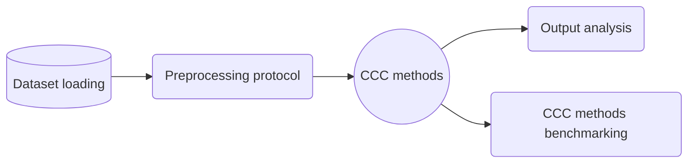

# Aim
> Systematic standardization and framework integration of public spatial-omics datasets for cell-cell communication (CCC) method analysis and benchmarking.

> **IMPORTANT**
> - Create code that will be reusable by the group
> - Focus on clarity and documentation

### PIPELINE:

# Internship-bound project

Please refer to `/docs/report.*`.

# Workflow
In the current version of the project all code is found in the `/code` folder. It is structured in a way which is dataset-specific. There is a data-loading file (e.g. `hartmann_data-loader.ipynb`), an exploratory data analysis file (e.g. `hartmann_exploratory-data-analysis.ipynb` and specific files for the application of each method (e.g. `hartmann_ncem_...` and `hartmann_misty_...`. Additionally, there are two helper files (`helper.py` and `helper.R`) containing auxiliary code like custom wrappers and functions.

It is imperative to execute the dataloader file first. The order of execution of the remaining files is up to the user's necessity.

# Datasets

## Colorrectal carcinoma: Hartmann-2021
[Hartmann, FJ et al. (2021). Single-cell metabolic profiling of human cytotoxic T cells. Nat Biotechnol 39, 186–197](https://www.nature.com/articles/s41587-020-0651-8)

[Download link](https://zenodo.org/record/3951613)

Focused on MIBI-TOF multiplexed images and segmented single-cell data of colorectal carcinoma and healthy adjacent colon tissue.
**Data:**
- `MIBI-TOF images`:
  - 1024 x 1024 pixels
  - 400 µm x 400 µm
  - have undergone noise removal as described in Keren et al. (2018)
- `Cell Segmentation masks`:
  - contain large non-cellular regions that need to be removed during downstream processing (Not corrected in this script)
- `MIBI-TOF derived single-cell data`:
  - signal under segmentation mask
    - A.K.A 1 cell per row
  - 1100 ± 524 mean spots per image
  - cell size normalized, arcsinh transformed and percentile normalized and contains manually annotated FlowSOM clustering results
  
  
 # Cell-cell communication methods
 
 ## Node-centric expression modeling [(NCEM)](https://www.nature.com/articles/s41587-022-01467-z)
 [Github](https://github.com/theislab/ncem)
 
 > A collection of graph-based machine learning models that predict index node expression based on neighbourhood node labels or expression.
 

 
 Pros:
 - Spatial
 - Input type agnositc
 - Prior-knowledge independend
 - No *leave-one-out* step
 
 Cons:
 - Only the linear model provides CCC label-dependencies
 - Linear model is label-dependent
 - Linear model is highly sensitive to labeling and upstream uncertainty and errors
 
 ## Multiview Intercellular SpaTial modeling framework [(MISTy)](https://genomebiology.biomedcentral.com/articles/10.1186/s13059-022-02663-5)
 [Github](https://saezlab.github.io/mistyR/)
 
 > Predictive machine learning framework that models different "views" based on custom defined spatial regions and/or feature aggregation functions and integrates them into a metamodel. In essence, the intrinsic signaling is modeled by the "intra-view" and the extrinsic signaling is modeled by different "extra-views" like a "para-" or a "juxta-view". The corresponding view contributions to the metamodel are inspected as well as the improvement to the model's predictive performance by incorporating the extrinsic views. The individual predictor-target feature importances are also calculated in a hold-one-out step.
 

 Pros:
 - Spatial
 - Highly flexible
 - Prior-knowledge independend
 - Scalable
 - Less susceptible to upstream uncertainty and errors
 - Hypothesis driven
 
 Cons:
 - Leave-one-out based
 - Hypothesis driven
 - Output more difficult to interpret
